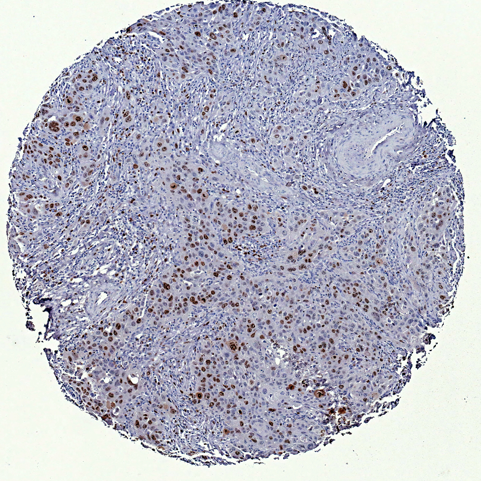
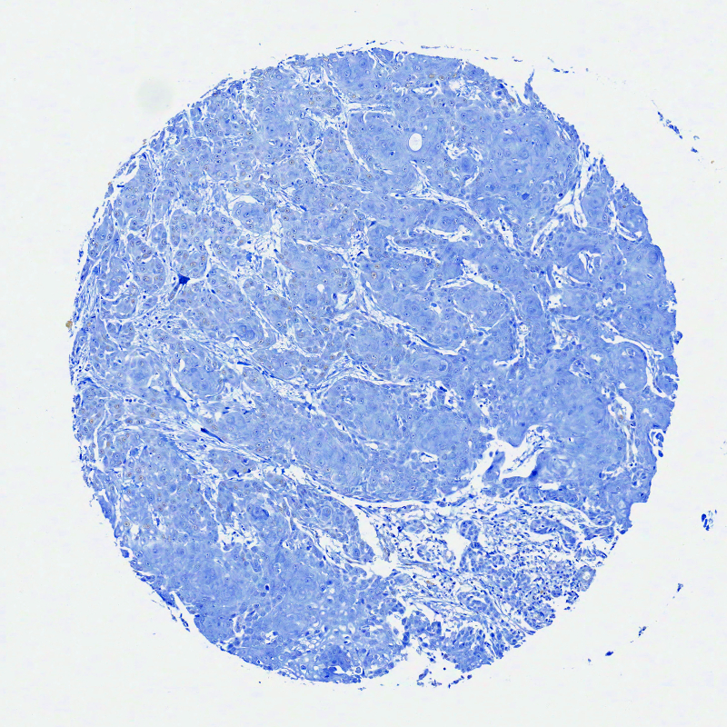

En esta sección se incluye fotografías, capturas de pantalla y microfotografías documentando y evidenciando el procedimiento utilizado para la inspección visual y la evaluación digital de la expresión imunohistoquímica de proteínas relacionadas con el cáncer de pene.

***

## Hematoxilina & eosina

***

***

## Inspección visual

***

***

***

***

## Evaluación digital

***

***
